## 2.1 什么是 DockerFile

什么是 DockerFile？DockerFile 是用来构建 Docker 镜像的文本文件，是由一条条构建镜像所需的指令和参数构成的脚本。所以我们得知，DockerFile 是用来构建 Docker 镜像的。

以前我们可以通过 `docker commit` 命令将一个容器重新打成一个新的镜像。但是在微服务中，我们可能需要配置很多参数，并且这些参数可能是实时动态变化的，而且微服务还需要和许多中间件之间建立联系。这个时候使用 `docker commit` 将微服务制作成镜像就不太方便了，这个时候 DockerFile 就可以解决问题。

对于 DockerFile 的学习，我们可以参照官网：https://docs.docker.com/engine/reference/builder/

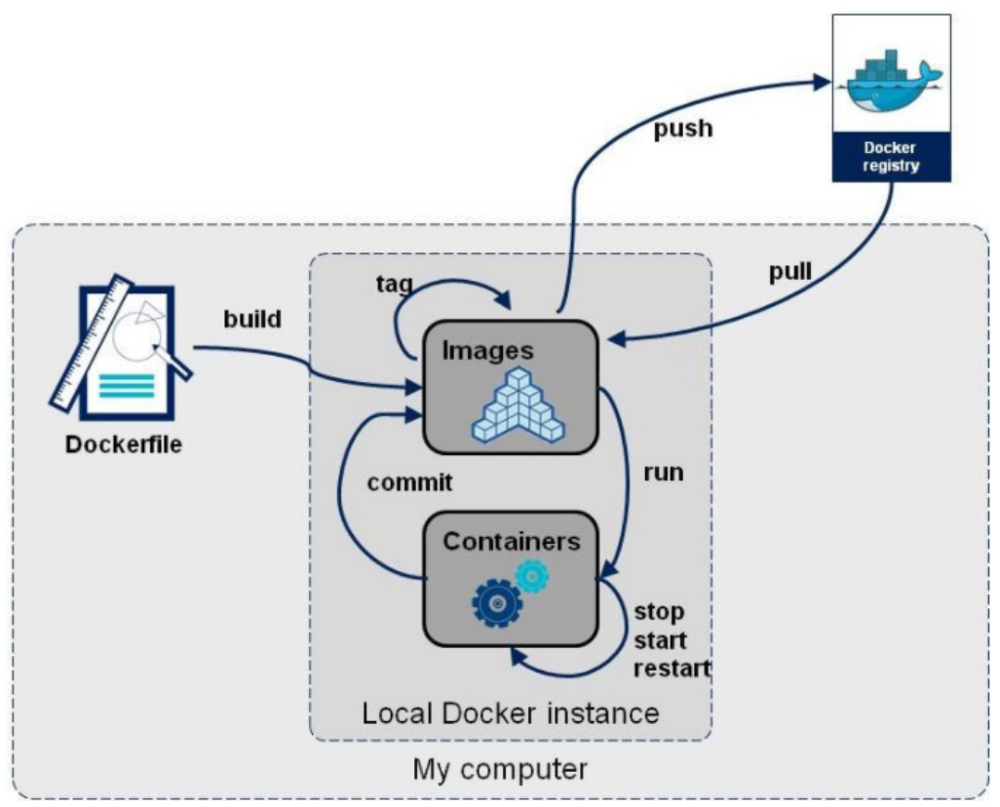

那我们如何通过 DockerFile 构建镜像?我们只需要3个步骤即可：

> - 编写 DockerFile 文件
> - docker build 命令构建镜像
> - docker run 镜像运行容器实例

## 2.2 DockerFile 构建过程解析

### 2.2.1 DockerFile 基础知识

1. 每条保留字指令都必须为大写字母且后面要跟随至少一个参数。

   什么是保留字指令？我们可以在官网上查看 https://docs.docker.com/engine/reference/builder/：

   

   - 指令按照从上到下，顺序执行。
   - `#` 表示注释。
   - 每条指令都会创建一个新的镜像层并对镜像进行提交。

### 2.2.2 Docker 执行 DockerFile 的大致流程

1. Docker 从基础镜像运行一个容器
2. 执行一条指令并对容器作出修改
3. 执行类似 `docker commit` 的操作提交一个新的镜像层
4. Docker 再基于刚提交的镜像运行一个新容器
5. 执行 DockerFile 中的下一条指令直到所有指令都执行完成

**总结：**

从应用软件的角度来看，Dockerfile、Docker 镜像与 Docker 容器分别代表软件的三个不同阶段，

- DockerFile 是软件的原材料
- Docker 镜像是软件的交付品
- Docker 容器则可以认为是软件镜像的运行态，也即依照镜像运行的容器实例
- DockerFile 面向开发，Docker 镜像成为交付标准，Docker 容器则涉及部署与运维，三者缺一不可，合力充当 Docker 体系的基石。

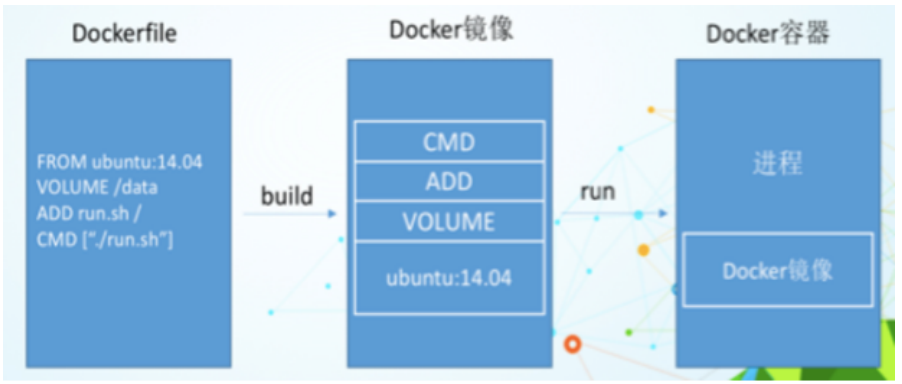

1. Dockerfile，需要定义一个 Dockerfile，Dockerfile 定义了镜像需要的一切东西 Dockerfile 涉及的内容包括执行代码或者是文件、环境变量、依赖包、运行时环境、动态链接库、操作系统的发行版、服务进程和内核进程(当应用进程需要和系统服务和内核进程打交道，这时需要考虑如何设计 namespace 的权限控制)等等。
2. Docker 镜像，在用 DockerFile 定义一个文件之后，`docker build` 时会产生一个 Docker 镜像，当运行 Docker 镜像时会真正开始提供服务。
3. Docker 容器，容器是直接提供服务的。

## 2.3 DockerFile 常用保留字指令

我们参考 tomcat8 的 DockerFile 入门：https://github.com/docker-library/tomcat/blob/master/8.5/jdk8/corretto-al2/Dockerfile

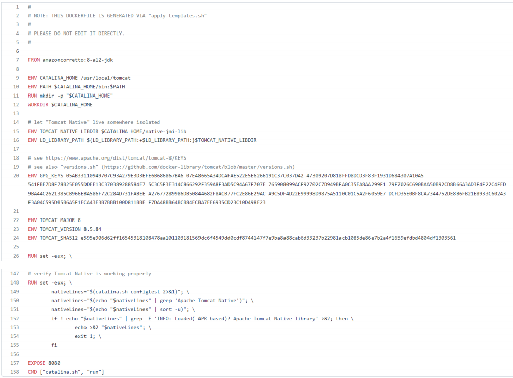

### 2.3.1 FROM 关键字

基础镜像，当前新镜像是基于哪个镜像的，指定一个已经存在的镜像作为模板，第一条必须是 FROM。比如我们上图的 tomcat 镜像，第一句就是 `FROM amazoncorretto:8-a12-jdk`。这句话的意思就是这个 tomcat 镜像是基于 `amazoncorretto:8-a12-jdk` 这个镜像制作的。

### 2.3.2 MAINTAINER

描述镜像维护者的姓名和邮箱地址。

### 2.3.3 RUN

容器构建的时候需要运行的命令。也就是 DockerFile 在构建（build）的时候需要执行的命令。运行命令的格式有两种。一种是 shell 格式，一种是 exec 格式。

- shell 格式

RUN 命令行命令 等同于在终端操作的 shell 命令。

比如 RUN yum -y install vim。就相当于在构建镜像的时候安装 vim 工具。

- exec格式

具体语法格式如下：

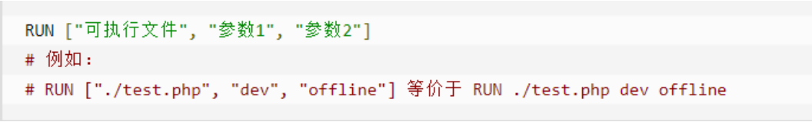

**总结：RUN 是在 docker build 的时候运行的命令。**

### 2.3.4 EXPOSE

当前容器对外暴露的端口。

### 2.3.4 WORKDIR

指定在创建容器后，终端默认登陆的进来工作目录，一个落脚点。我们以 tomcat 镜像为例，让我们启动运行一个 tomcat 容器之后，我们观察进入容器之后的默认目录：

```bash
[root@shjava101 ~]# docker run -it -p 8080:8080 tomcat /bin/bash
root@99d0a0da1a9f:/usr/local/tomcat# pwd
/usr/local/tomcat
```

我们发现现在进入 tomcat 容器之后的默认目录就是 /usr/local/tomcat。

### 2.3.5 USER

指定该镜像以什么样的用户去执行，如果都不指定，默认是 root。一般我们都是以 root 用户去运行我们的镜像。

### 2.3.6 ENV

用来在构建镜像过程中设置环境变量。这个环境变量可以在后续的任何 RUN 指令中使用，这就如同在命令前面指定了环境变量前缀一样。

也可以在其它指令中直接使用这些环境变量。我们以 tomcat 的环境变量为例：

```DockerFile
ENV CATALINA_HOME /usr/local/tomcat。
WORKDIR $CATALINA_HOME。
```

这就证明了为什么 tomcat 容器运行之后的默认落脚点是 /usr/local/tomcat。

### 2.3.7 VOLUME

容器数据卷，用于数据保存和持久化工作。

### 2.3.8 ADD

将宿主机目录下的文件拷贝进镜像且会自动处理 URL 和解压 tar 压缩包。

### 2.3.9 COPY

类似 ADD，拷贝文件和目录到镜像中。 将从构建上下文目录中 <源路径> 的文件 / 目录复制到新的一层的镜像内的 <目标路径> 位置。

语法格式：

```DockerFile
COPY src dest
COPY ["src", "dest"]
# src: 源文件或者源目录
# dest: 容器内的指定路径，该路径不用事先建好，路径不存在的话，会自动创建。
```

### 2.3.10 CMD

指定容器启动后的要干的事情。CMD 后面跟的指令格式和 RUN 类似，也有两种格式：

- `shell` 格式：`CMD <命令>`
- `exec` 格式：`CMD ["可执行文件", "参数1", "参数2", ...]`
- 参数列表格式：`CMD ["参数1", "参数2", ...]`。在指定了 `ENTRYPOINT` 指令后，用 `CMD` 指定具体的参数。

我们以 tomcat 容器为例，我们首先启动 tomcat 容器：

```bash
[root@shjava101 ~]# docker run -it -p 8080:8080 30ef4019761d
```

发现如下效果：

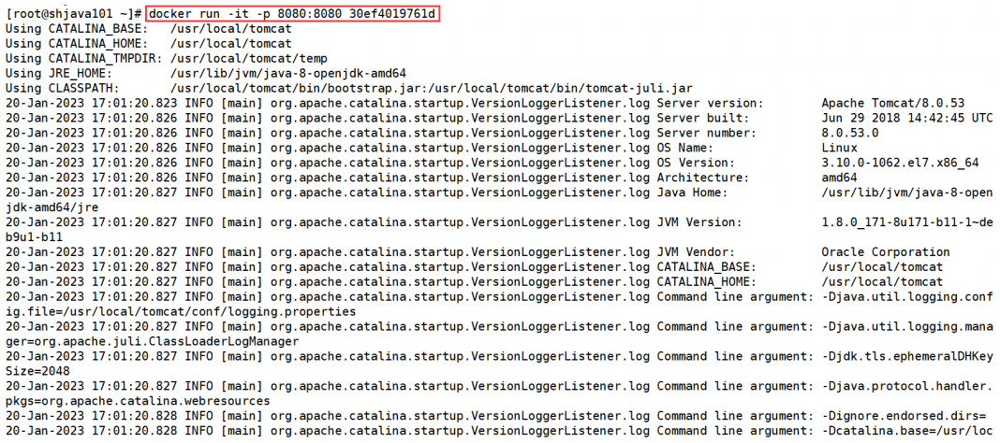

我们发现启动 tomcat 容器的时候，显示了很多启动日志信息。为什么这样呢，就是因为 tomcat 的 DockerFile 里面的最后一句话：

CMD ["catalina.sh","run"]。也就是运行了 catalina.sh 命令。

**需要注意的是： Dockerfile 中可以有多个 CMD 指令，但只有最后一个生效，CMD 会被 docker run 之后的参数替换。**

这句话是什么意思呢？

我们以如下这条命令为例启动 tomcat，我们在最后面加上了一句 /bin/bash 命令：

```bash
[root@shjava101 ~]# docker run -it -p 8080:8080 30ef4019761d /bin/bash
```

此时我们发现，tomcat 容器启动之后，相关的启动日志信息没有出现：

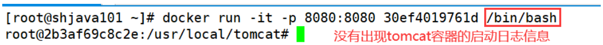

这就说明了 catalina.sh 命令没有运行，为什么 因为相当于使用 CMD 运行了 /bin/bash 命令，覆盖了 catalina.sh 命令。如下所示：

```
CMD ["catalina.sh","run"]
CMD ["/bin/bash","run"]
```

最后一定要注意区分 RUN 和 CMD 命令的区别：

**RUN 命令是 docker build (构建) 的时候运行。CMD 是 docker run 的时候运行。**

### 2.3.11 ENTRYPOINT

也是用来指定一个容器启动时要运行的命令，它类似于 CMD 指令，但是 ENTRYPOINT 不会被 docker run 后面的命令覆盖， 而且这些命令行参数会被当作参数送给 ENTRYPOINT 指令指定的程序。

命令格式：


ENTRYPOINT 可以和 CMD 一起用，一般是变参才会使用 CMD，这里的 CMD 等于是在给 ENTRYPOINT 传参。当指定了 ENTRYPOINT 后，CMD 的含义就发生了变化，不再是直接运行其命令而是将 CMD 的内容作为参数传递给 ENTRYPOINT 指令。

案例如下：假设已通过 Dockerfile 构建了 nginx:test 镜像：

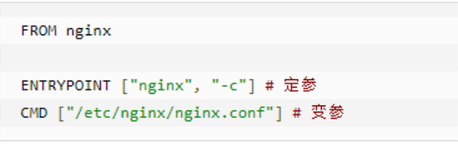

| 是否传参 | 按照 DockerFile 编写执行 | 传参运行 |
| :---: | :---: | :---: |
| Docker 命令 | `docker run nginx:test` | `docker run nginx:test -c /etc/nginx/new.conf` |
| 衍生出的实际命令 | `nginx -c /etc/nginx/nginx.conf` | `nginx -c /etc/nginx/new.conf` |

## 2.4 DockerFile 案例

需求：自定义镜像 Centos。要求 Centos7 镜像具备 vim + ifconfig + jdk8

### 2.4.1 前期准备工作

前期准备工作：准备 Centos7 镜像。

```bash
[root@shjava101 ~]# docker search centos
[root@shjava101 ~]# docker pull centos:7
```

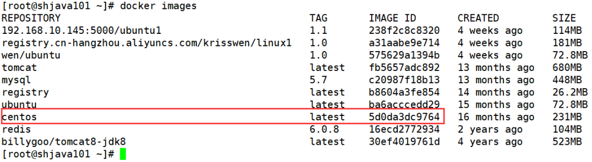

现在我们通过 Centos 镜像来运行 Centos 这个容器：

```bash
[root@shjava101 ~]# docker run -it 5d0da3dc9764 /bin/bash
[root@08f77f750842 /]# vim a.txt
bash: vim: command not found
[root@08f77f750842 /]# ifconfig
bash: ifconfig: command not found
[root@08f77f750842 /]# java -version
bash: java: command not found
```

我们发现这个 Centos 容器里面 vim ifconfig 工具以及 java8 的环境都没有。因为我们现在运行的 Centos7 容器只具备最基本的环境。我们需要自己进行相关功能的加强。

### 2.4.2 编写 DockerFile 文件

**第一步：我们新开一个命令窗口，新建一个文件夹 myfile，并上传一个 Linux 版本的 jdk。**

```bash
[root@shjava101 ~]# cd /
[root@shjava101 /]# mkdir myfile
[root@shjava101 /]# cd myfile/
[root@shjava101 myfile]# pwd
/myfile
[root@shjava101 myfile]# ll
total 185312
-rw-r--r--. 1 root root 189756259 Jan 22 21:06 jdk-8u161-linux-x64.tar.gz
```

**第二步：编写 DockerFile 文件**

在 myfile 目录下面，编写 DockerFile 文件，注意文件名称首字母一定要是大写的 D。

```bash
[root@shjava101 ~]# vim Dockerfile
```

并在文件里面编写如下内容：

```DockerFile
FROM centos:7
MAINTAINER krisswen<krisswen@sina.cn>

ENV MYPATH /usr/local
WORKDIR $MYPATH

# 安装 vim 编辑器
RUN yum -y install vim
#安装 ifconfig 命令查看网络 IP
RUN yum -y install net-tools
#安装 java8 及 lib 库
RUN yum -y install glibc.i686
RUN mkdir /usr/local/java
# ADD 是相对路径 jar，把 jdk-8u161-linux-x64.tar.gz 添加到容器中,安装包必须要和 Dockerfile 文件在同一位置
ADD jdk-8u161-linux-x64.tar.gz /usr/local/java/
# 配置 java 环境变量
ENV JAVA_HOME /usr/local/java/jdk1.8.0_161
ENV JRE_HOME $JAVA_HOME/jre
ENV CLASSPATH $JAVA_HOME/lib/dt.jar:$JAVA_HOME/lib/tools.jar:$JRE_HOME/lib:$CLASSPATH
ENV PATH $JAVA_HOME/bin:$PATH

EXPOSE 80
CMD echo $MYPATH
CMD echo "success--------------ok"
CMD /bin/bash
```

保存并退出。

**第三步：运行 DockerFile**

运行命令的语法格式：

```
docker build -t 镜像名称:标签名称 .
```

**注意：标签名称后面有个空格和点**

```bash
[root@shjava101 myfile]# docker build -t newcentos7:1.0 .
```

经过漫长的等待，我们的镜像终于制作成功了。

```bash
[root@shjava101 myfile]# docker images
REPOSITORY    TAG    IMAGE ID        CREATED          SIZE
newcentos7    1.0    12394db42321    8 seconds ago    1.27GB
<none>        <none> e2727622a1a7    9 minutes ago    231MB
```

**第四步：运行镜像**

```bash
[root@shjava101 myfile]# docker run -it 12394db42321 /bin/bash
```

我们发现进入容器之后，vim 工具、ifconfig 工具，还有 jdk 环境都有了。说明我们使用 DockerFile 制作的镜像没有问题！

### 2.4.3 虚悬镜像

镜像名称和标签都为 `<none>` 的镜像就是虚悬镜像。当我们在重构镜像的过程中有可能产生虚悬镜像。这种镜像没有实际的价值，一般需要将其删除。

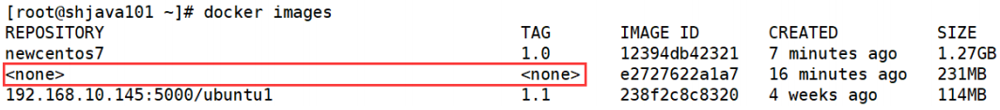

我们也可以自己构建一个虚悬镜像。

```bash
[root@shjava101 myfile]# mkdir test
[root@shjava101 myfile]# cd test
[root@shjava101 test]# vim Dockerfile
```

在 Dockerfile 文件中输入以下内容：

```bash
FROM mysql:5.7
CMD echo 'success'
```

保存并退出，build 镜像：

```bash
[root@shjava101 test]# docker build .
```

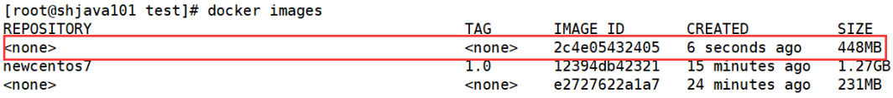

现在我们需要查看所有的虚悬镜像，然后将所有的虚悬镜像全部删除：

```bash
[root@shjava101 test]# docker image ls -f dangling=true # 查看所有的虚悬镜像
REPOSITORY  TAG      IMAGE ID        CREATED           SIZE
<none>      <none>   2c4e05432405    4 minutes ago     448MB
<none>      <none>   e2727622a1a7    28 minutes ago    231MB
[root@shjava101 test]# docker image prune # 删除所有的虚悬镜像
WARNING! This will remove all dangling images.
Are you sure you want to continue? [y/N] y
```

## 2.5 使用 DockerFile 进行微服务部署

### 2.5.1 编写一个微服务

**第一步：引入依赖**

```xml
<parent>
    <groupId>org.springframework.boot</groupId>
    <artifactId>spring-boot-starter-parent</artifactId>
    <version>2.5.6</version>
</parent>

<dependencies>
    <dependency>
        <groupId>org.springframework.boot</groupId>
        <artifactId>spring-boot-starter-web</artifactId>
        <version>2.5.6</version>
    </dependency>
</dependencies>

<build>
    <plugins>
        <plugin>
            <groupId>org.springframework.boot</groupId>
            <artifactId>spring-boot-maven-plugin</artifactId>
        </plugin>
        <plugin>
            <groupId>org.apache.maven.plugins</groupId>
            <artifactId>maven-resources-plugin</artifactId>
            <version>3.1.0</version>
        </plugin>
    </plugins>
</build>
```

**第二步：编写启动类**

```java
@SpringBootApplication
public class App {
    public static void main(String[] args) {
    	SpringApplication.run(App.class,args);
    }
}
```

**第三步：编写配置文件 application.yml**

```yml
server:
    port: 7001
```

**第四步：编写 controller**

```java
@RestController
@RequestMapping("demo1")
public class HelloController {
    @RequestMapping("hello")
    public String hello(){
        return "hello, docker....";
    }
}
```

**第五步：运行 package 命令，打成 jar 包**

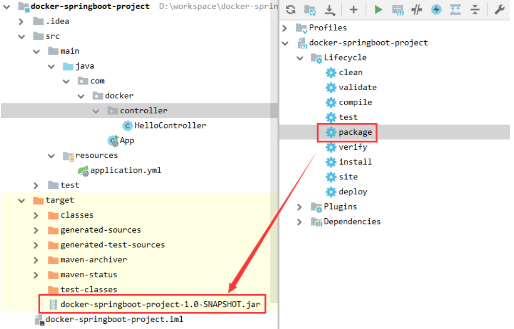

**第六步：将打好的 jar 包上传至指定目录**

```bash
[root@shjava101 myfile]# mkdir springboot
[root@shjava101 myfile]# cd springboot/
[root@shjava101 springboot]# ll
total 4
-rw-r--r--. 1 root root 3089 Jan 22 22:43 docker-springboot-project-1.0-SNAPSHOT.jar
```

### 2.5.2 编写 Dockerfile，打包成镜像

使用 vim 命令创建 DockerFile 文件，并输入以下内容：

```DockerFile
# 基础镜像使用 java
FROM java:8
# 作者
MAINTAINER wen
# VOLUME 指定临时文件目录为 /tmp，在主机 /var/lib/docker 目录下创建了一个临时文件并链接到容器的 /tmp
VOLUME /tmp
# 将 jar 包添加到容器中并更名为 springboot_docker.jar
ADD docker-springboot-project-1.0-SNAPSHOT.jar springboot_docker.jar
# touch 命令的作用是修改这个文件的访问时间和修改时间为当前时间，不会修改文件的内容。
RUN bash -c 'touch /springboot_docker.jar'
ENTRYPOINT ["java","-jar","/springboot_docker.jar"]
# 暴露 7001 端口作为微服务
EXPOSE 7001
```

保存并退出之后，接下来使用 DockerFile 文件打成镜像：

```bash
[root@shjava101 springboot]# docker build -t springboot_docker:1.1 .
```

### 2.5.3 运行容器，访问并测试

首先我们查看镜像是否打包成功：

```bash
[root@shjava101 springboot]# docker images
REPOSITORY           TAG    IMAGE ID        CREATED          SIZE
springboot_docker    1.1    9f07e1ccb71c    5 minutes ago    643MB
```

接下来我们通过镜像运行一个容器：

```bash
[root@shjava101 springboot]# docker run -d -p 7001:7001 springboot_docker:1.1
073e9b29cd18efd45fc2cc9a6846fcea062f966d3408aabd81121fc77f8c6425
[root@shjava101 springboot]# docker ps
CONTAINER ID    IMAGE    COMMAND    CREATED    STATUS    PORTS    NAMES
073e9b29cd18    springboot_docker:1.1    "java -jar /springbo…"    3 seconds ago      Up 2 seconds      0.0.0.0:7001->7001/tcp, :::7001->7001/tcp eager_hodgkin
```

通过浏览器访问测试效果：

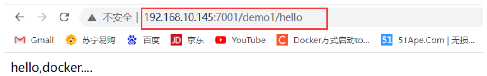