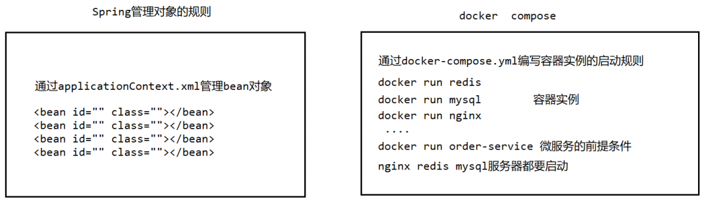
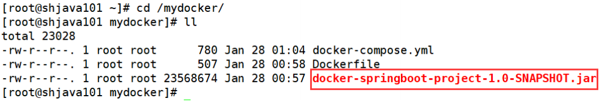
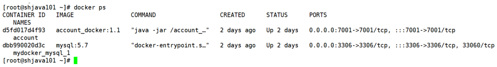
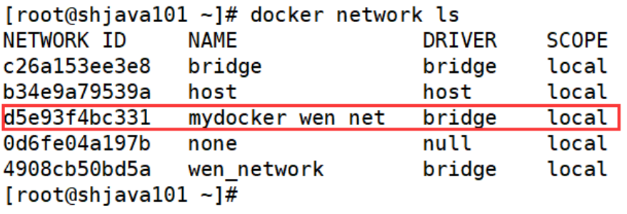
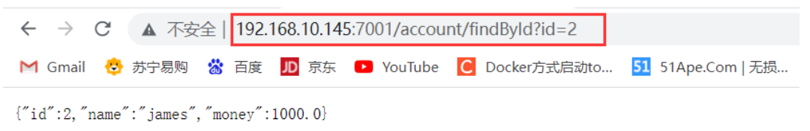

## 4.1 Docker Compose 的基本概述

Docker Compose 是 Docker 官方的开源项目，负责实现对 Docker 容器集群的快速编排。Compose 是 Docker 公司推出的一个工具软件，可以管理多个 Docker 容器组成一个应用。你需要定义一个 YAML 格式的配置文件 `docker-compose.yml`，**写好多个容器之间的调用关系**。然后，只要一个命令，就能同时启动 / 关闭这些容器。

我们可以通过一幅图来理解什么是 Docker Compose。



1. Docker 建议我们每一个容器中只运行一个服务，因为 Docker 容器本身占用资源极少，所以最好是将每个服务单独的分割开来。
2. 但是这样我们又面临了一个问题？如果我需要同时部署好多个服务，难道要每个服务单独写 DockerFile 然后在构建镜像，构建容器，这样非常复杂，所以 Docker 官方给我们提供了 Docker Compose 多服务部署的工具。
3. 例如，要实现一个 Web 微服务项目，除了 Web 服务容器本身，往往还需要再加上后端的数据库 MySQL 服务容器，Redis 服务器，注册中心 eureka，甚至还包括负载均衡容器等。
4. Compose 允许用户通过一个单独的 `docker-compose.yml` 模板文件（YAML 格式）来定义一组相关联的应用容器为一个项目 (project)。
5. 可以很容易地用一个配置文件定义一个多容器的应用，然后使用一条指令安装这个应用的所有依赖，完成构建。Docker Compose 解决了容器与容器之间如何管理编排的问题。

下面我们就开始安装 docker compose，大家按照文档笔记直接安装即可。

```bash
[root@shjava101 ~]# curl -L https://get.daocloud.io/docker/compose/releases/download/1.25.1/docker-compose-`uname -s`-`uname -m` -o /usr/local/bin/docker-compose
[root@shjava101 ~]# chmod +x /usr/local/bin/docker-compose # 给这个 docker-compose 文件设置权限
[root@shjava101 ~]# docker-compose --version
docker-compose version 1.25.1, build a82fef07 
```

## 4.2 Docker Compose 的基本使用

### 4.2.1 Docker Compose 的基本概念

**一个文件**：`docker-compose.yml` 描述多个容器之间的运行规则。

**两个要素**：

- 服务 (service) 一个个应用容器实例，比如订单微服务、库存微服务、MySQL 容器、nginx 容器或者 Redis 容器。
- 工程 (project) 由一组关联的应用容器组成的一个完整业务单元，在 `docker-compose.yml` 文件中定义。

### 4.2.2 Docker Compose 使用的三个步骤

1. 编写 Dockerfile 定义各个微服务应用并构建出对应的镜像文件。
2. 使用 `docker-compose.yml` 定义一个完整业务单元，安排好整体应用中的各个容器服务。
3. 最后，执行 `docker-compose up` 命令来启动并运行整个应用程序，完成一键部署上线。

### 4.2.3 Docker Compose 的常用基本命令

```bash
docker-compose -h               # 查看帮助
docker-compose up               # 启动所有 docker-compose 服务
docker-compose up -d            # 启动所有 docker-compose 服务并后台运行
docker-compose down                 # 停止并删除容器、网络、卷、镜像。
docker-compose exec yml里面的服务id   # 进入容器实例内部 docker-compose
exec docker-compose.yml文件中写的服务id /bin/bash
docker-compose ps               # 展示当前 docker-compose 编排过的运行的所有容器
docker-compose top              # 展示当前 docker-compose 编排过的容器进程

docker-compose logs yml里面的服务id   # 查看容器输出日志
docker-compose config               # 检查配置
docker-compose config -q            # 检查配置，有问题才有输出
docker-compose restart              # 重启服务
docker-compose start                # 启动服务
docker-compose stop                 # 停止服务
```

## 4.3 使用 Docker Compose 进行服务编排

### 4.3.1 准备微服务

- 引入 POM 依赖b

```xml
<parent>
    <groupId>org.springframework.boot</groupId>
    <artifactId>spring-boot-starter-parent</artifactId>
    <version>2.5.6</version>
</parent>

<dependencies>
    <dependency>
        <groupId>org.springframework.boot</groupId>
        <artifactId>spring-boot-starter-web</artifactId>
        <version>2.5.6</version>
    </dependency>

    <dependency>
        <groupId>com.alibaba</groupId>
        <artifactId>druid-spring-boot-starter</artifactId>
        <version>1.1.10</version>
    </dependency>

    <dependency>
        <groupId>org.mybatis.spring.boot</groupId>
        <artifactId>mybatis-spring-boot-starter</artifactId>
        <version>1.3.0</version>
    </dependency>

    <dependency>
        <groupId>mysql</groupId>
        <artifactId>mysql-connector-java</artifactId>
        <version>5.1.6</version>
    </dependency>
</dependencies>

<build>
    <plugins>
        <plugin>
            <groupId>org.springframework.boot</groupId>
            <artifactId>spring-boot-maven-plugin</artifactId>
        </plugin>
        <plugin>
            <groupId>org.apache.maven.plugins</groupId>
            <artifactId>maven-resources-plugin</artifactId>
            <version>3.1.0</version>
        </plugin>
    </plugins>
</build>
```

- 编写启动类

```java
@SpringBootApplication
public class App {
    public static void main(String[] args) {
        SpringApplication.run(App.class,args);
    }
}
```

编写配置文件

```properties
server.port=7001
# 配置数据源类型
spring.datasource.type=com.alibaba.druid.pool.DruidDataSource
# 配置数据库用户名
spring.datasource.username=root
# 配置数据库密码
spring.datasource.password=123456
# 配置连接数据库的url
# spring.datasource.url=jdbc:mysql://192.168.10.145:3306/docker?useUnicode=true&characterEncoding=utf-8&useSSL=false
# mysql 替代 192.168.10.145 通过容器名称进行访问
spring.datasource.url=jdbc:mysql://mysql:3306/docker?useUnicode=true&characterEncoding=utf-8&useSSL=false
# 配置驱动类
spring.datasource.driver-class-name=com.mysql.jdbc.Driver
```

- 编写 dao

```java
@Mapper
public interface AccountDao {
    @Select("select * from account where id = #{id}")
    public Account findById(Integer id);
}
```

- 编写 service

```java
public interface AccountService {
    public Account findAccountById(Integer id);
}
```

```java
@Service
@SuppressWarnings("all")
public class AccountServiceImpl implements AccountService {

    @Autowired
    AccountDao accountDao;

    @Override
    public Account findAccountById(Integer id) {
        return accountDao.findById(id);
    }
}
```

- 编写 controller

```java
@RestController
@RequestMapping("account")
public class AccountController {

    @Autowired
    AccountService accountService;


    @RequestMapping("findById")
    public Account findById(@RequestParam("id") Integer id){
        return accountService.findAccountById(id);
    }
}
```

- 打包项目成 jar 包，并上传到指定目录

使用 mvn package 命令将微服务打成 jar 包并上传至 Linux 服务器 /mydocker 目录下面。



### 4.3.2 编写 docker-compose.yml 文件

在 /mydocker 目录下面编写 `docker-compose.yml` 文件

```yml
version: "3"

services:
    microService:
        image: account_docker:1.1
        container_name: account
        ports:
        - "7001:7001"
        volumes:
        - /app/microService:/data
        networks:
        - wen_net
        depends_on:
        - mysql

    mysql:
        image: mysql:5.7
        environment:
            MYSQL_ROOT_PASSWORD: '123456'
            MYSQL_ALLOW_EMPTY_PASSWORD: 'no'
            MYSQL_DATABASE: 'docker'
            MYSQL_USER: 'wen'
            MYSQL_PASSWORD: 'wen123'
        ports:
        - "3306:3306"
        volumes:
        - /app/mysql/db:/var/lib/mysql
        - /app/mysql/conf/my.cnf:/etc/my.cnf
        - /app/mysql/init:/docker-entrypoint-initdb.d
        networks:
        - wen_net
        command: --default-authentication-plugin=mysql_native_password # 解决外部无法访问

networks:
    wen_net:
```

### 4.3.3 编写 DockerFile

```Dockerfile
# 基础镜像使用 java
FROM java:8
# 作者
MAINTAINER krisswen
# VOLUME 指定临时文件目录为 /tmp，在主机 /var/lib/docker 目录下创建了一个临时文件并链接到容器的 /tmp
VOLUME /tmp
# 将 jar 包添加到容器中并更名为 docker-springboot-project-1.0-SNAPSHOT.jar
ADD docker-springboot-project-1.0-SNAPSHOT.jar account_docker.jar
# 运行 jar 包
RUN bash -c 'touch /account_docker.jar'
ENTRYPOINT ["java","-jar","/account_docker.jar"]
# 暴露 7001 端口作为微服务
EXPOSE 7001
```

### 4.3.4 构建镜像

```bash
[root@shjava101 mydocker]# docker build -t account_docker:1.1 .
```

### 4.3.5 启动所有 docker-compose 服务

```bash
[root@shjava101 mydocker]# docker-compose up -d
```

我们查看运行的容器：



查看 Docker 网络：



在数据表里面添加对应的数据，使用浏览器进行测试：

