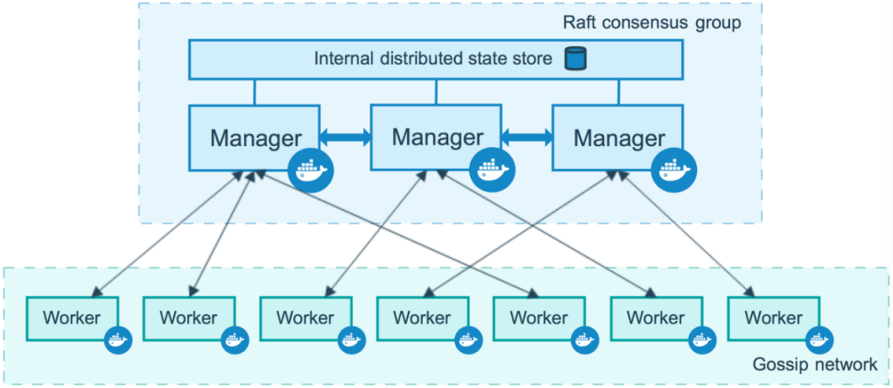
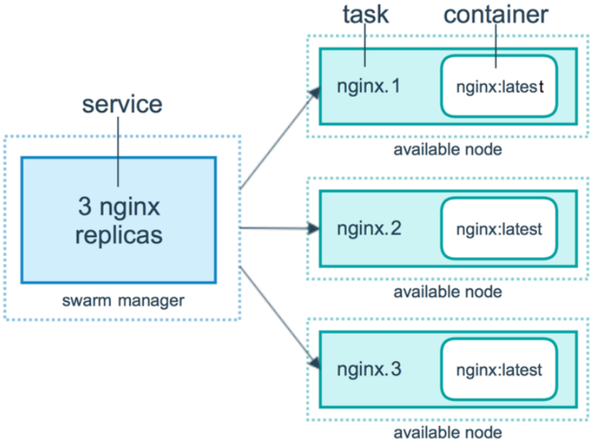
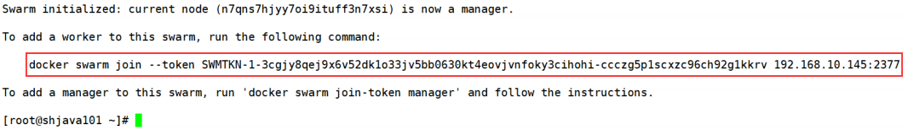
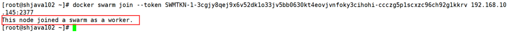
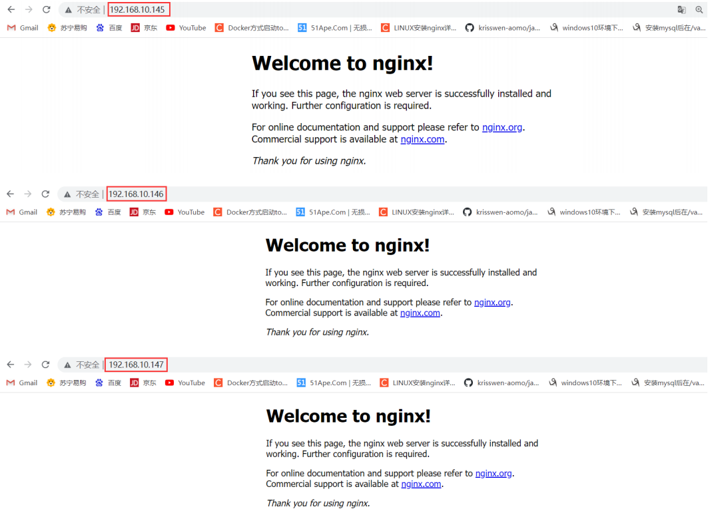
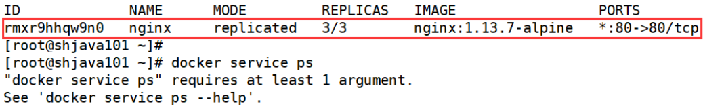
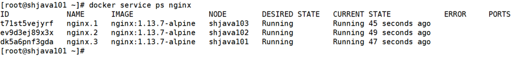
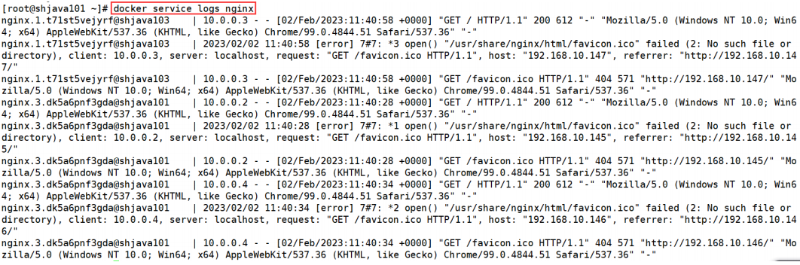
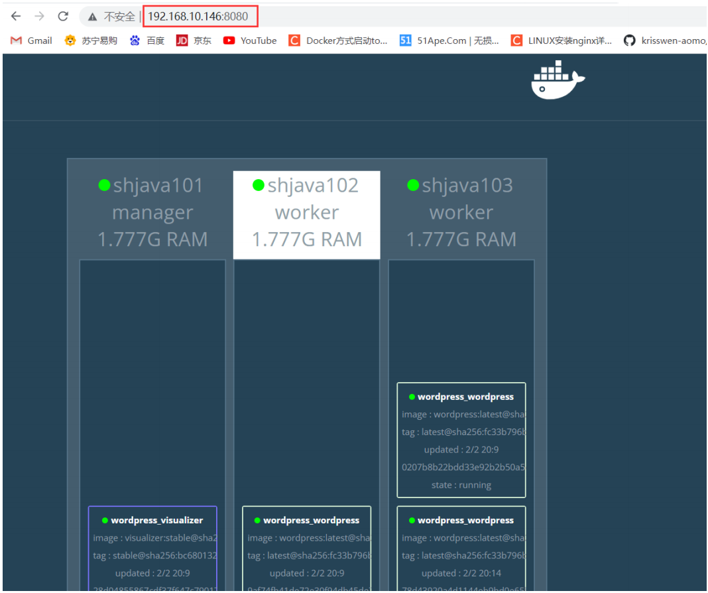

一般情况下，我们都在一台机器下部署容器，但实际情况下，应用如果只在一台机器上无法满足我们的需求，包含的容器比较多。因此在生产环境下部署我们的应用就会涉及到非常多的容器，这样就会给我们带来一系列的问题：

- 怎么去管理这么多的容器？
- 怎么能方便的横向扩展？
- 如果容器 down 了，怎么能自动恢复？
- 如何去更新容器而不影响业务？
- 如何去监控追踪这些容器？
- 怎么去调度容器的创建？
- 保护隐私数据？

这样我们就需要容器编排技术，Swarm Mode 应运而生。

Swarm 并不是唯一一个可以做容器编排的工具，只不过 Swarm 是内置于 Docker 的一个工具。因此我们使用 Swarm 时不需要安装任何东西，Swarm 已经内置到我们系统里面了，只不过我们没有运行在 Swarm 模式下，我们一般运行在单机模式下。因此，Swarm 就是初学者接触容器编排的第一个工具。

在使用 Swarm 之前，我们先了解 Swarm 的基本概念。

## 7.1 Swarm 的基本概念

### 7.1.1 节点

运行 Docker 的主机可以主动初始化一个 Swarm 集群或者加入一个已存在的 Swarm 集群，这样这个运行 Docker 的主机就成为一个 Swarm 集群的节点 (node)。

节点分为管理 (manager) 节点和工作 (worker) 节点。

管理节点用于 Swarm 集群的管理，docker swarm 命令基本只能在管理节点执行（节点退出集群命令 docker swarm leave 可以在工作节点执行）。一个 Swarm 集群可以有多个管理节点，但只有一个管理节点可以成为 leader，leader 通过 raft 协议实现。

工作节点是任务执行节点，管理节点将服务 (service) 下发至工作节点执行。管理节点默认也作为工作节点。你也可以通过配置让服务只运行在管理节点。

来自 Docker 官网的这张图片形象的展示了集群中管理节点与工作节点的关系。



### 7.1.2 服务和任务

任务 (Task) 是 Swarm 中的最小的调度单位，目前来说就是一个单一的容器。

服务 (Services) 是指一组任务的集合，服务定义了任务的属性。服务有两种模式：

- replicated services 按照一定规则在各个工作节点上运行指定个数的任务。
- global services 每个工作节点上运行一个任务。

两种模式通过 `docker service create` 的 `--mode` 参数指定。

来自 Docker 官网的这张图片形象的展示了容器、任务、服务的关系。



## 7.2 创建 Swarm 集群

需求：本课程创建一个包含一个管理节点和两个工作节点的最小 Swarm 集群。

### 7.2.1 创建管理节点

执行 `docker swarm init` 命令的节点自动成为管理节点。在已经安装好 Docker 的主机 (192.168.10.145) 上执行如下命令：

```bash
[root@shjava101 ~]# docker swarm init --advertise-addr 192.168.10.145
Swarm initialized: current node (n7qns7hjyy7oi9ituff3n7xsi) is now a manager.

To add a worker to this swarm, run the following command:
    docker swarm join --token SWMTKN-1-3cgjy8qej9x6v52dk1o33jv5bb0630kt4eovjvnfoky3cihohi-ccczg5p1scxzc96ch92g1kkrv 192.168.10.145:2377

To add a manager to this swarm, run 'docker swarm join-token manager' and follow the instructions.
```

### 7.2.2 增加工作节点

上一步初始化了一个 Swarm 集群，拥有了一个管理节点，在其他的 Docker 主机中分别执行如下命令，创建工作节点并加入到集群中。



在 192.168.10.146 机器和 192.168.10.147 机器上分别执行上面红框的命令：

```bash
[root@shjava103 ~]# docker swarm join --token SWMTKN-1-3cgjy8qej9x6v52dk1o33jv5bb0630kt4eovjvnfoky3cihohi-ccczg5p1scxzc96ch92g1kkrv 192.168.10.145:2377
```

如果成功，会有以下提示：



**注意：已经是管理节点的主机不能再创建工作节点！**

### 7.2.3 查看集群

经过上边的两步，已经拥有了一个最小的 Swarm 集群，包含一个管理节点和两个工作节点。在管理节点使用 docker node ls 查看集群。

```bash
[root@shjava101 ~]# docker node ls
```

## 7.3 部署服务

我们使用 `docker service` 命令来管理 Swarm 集群中的服务，该命令只能在管理节点运行。

### 7.3.1 新建服务

现在我们在上一节创建的 Swarm 集群中运行一个名为 nginx 服务。

```bash
[root@shjava101 ~]# docker service create --replicas 3 -p 80:80 --name nginx nginx:1.13.7-alpine
rmxr9hhqw9n09eftpa98xnubj
overall progress: 3 out of 3 tasks
1/3: running [==================================================>]
2/3: running [==================================================>]
3/3: running [==================================================>]
verify: Service converged
```

现在我们使用浏览器，输入任意节点 IP，即可看到 nginx 默认页面。



### 7.3.2 查看服务

使用 `docker service ls` 来查看当前 Swarm 集群运行的服务。



使用 `docker service ps` 来查看某个服务的详情。


```bash
[root@shjava101 ~]# docker service ps nginx
```



使用 `docker service logs` 来查看某个服务的日志。



### 7.3.3 服务伸缩

我们可以使用 `docker service scale` 对一个服务运行的容器数量进行伸缩。当业务处于高峰期时，我们需要扩展服务运行的容器数量。

```bash
[root@shjava101 ~]# docker service scale nginx=5
nginx scaled to 5
overall progress: 5 out of 5 tasks
1/5: running [==================================================>]
2/5: running [==================================================>]
3/5: running [==================================================>]
4/5: running [==================================================>]
5/5: running [==================================================>]
[root@shjava101 ~]# docker service ps nginx
ID NAME IMAGE NODE DESIRED STATE
CURRENT STATE ERROR PORTS
t71st5vejyrf nginx.1 nginx:1.13.7-alpine shjava103 Running
Running 10 minutes ago
ev9d3ej89x3x nginx.2 nginx:1.13.7-alpine shjava102 Running
Running 11 minutes ago
dk5a6pnf3gda nginx.3 nginx:1.13.7-alpine shjava101 Running
Running 11 minutes ago
nozmp1gnb9yz nginx.4 nginx:1.13.7-alpine shjava103 Running
Running 22 seconds ago
ivw72iml1ui3 nginx.5 nginx:1.13.7-alpine shjava101 Running
Running 22 seconds ago
```

当业务平稳时，我们需要减少服务运行的容器数量。

```bash
[root@shjava101 ~]# docker service scale nginx=2
nginx scaled to 2
overall progress: 2 out of 2 tasks
1/2: running [==================================================>]
2/2: running [==================================================>]
verify: Service converged
[root@shjava101 ~]# docker service ps nginx
ID NAME IMAGE NODE DESIRED STATE
CURRENT STATE ERROR PORTS
t71st5vejyrf nginx.1 nginx:1.13.7-alpine shjava103 Running
Running 12 minutes ago
ev9d3ej89x3x nginx.2 nginx:1.13.7-alpine shjava102 Running
Running 13 minutes ago
```

### 7.3.4 删除服务

使用 `docker service rm` 来从 Swarm 集群移除某个服务。

```bash
[root@shjava101 ~]# docker service rm nginx
nginx
```

## 7.4 使用 compose 文件

正如之前使用 docker-compose.yml 来一次配置、启动多个容器，在 Swarm 集群中也可以使用 compose 文件 docker-compose.yml 来配置、启动多个服务。

上一节中，我们使用 docker service create 一次只能部署一个服务，使用 docker-compose.yml 我们可以一次启动多个关联的服务。

我们以在 Swarm 集群中部署 visualizer 说明。visualizer 服务提供一个可视化页面，我们可以从浏览器中很直观的查看集群中各个服务的运行节点。

### 7.4.1 编写 docker-compose.yml

在根目录创建 swarm 目录，进入 swarm 目录，编写 docker-compose.yml 文件。

```bash
[root@shjava101 /]# mkdir /swarm
[root@shjava101 /]# cd swarm
[root@shjava101 swarm]# vim docker-compose.yml
```

```yml
version: "3"

services:
    wordpress:
    image: wordpress
    ports:
        - 80:80
    networks:
        - overlay
    environment:
        WORDPRESS_DB_HOST: db:3306
        WORDPRESS_DB_USER: wordpress
        WORDPRESS_DB_PASSWORD: wordpress
    deploy:
        mode: replicated
        replicas: 3

    db:
    image: mysql
    networks:
        - overlay
    volumes:
        - db-data:/var/lib/mysql
    environment:
        MYSQL_ROOT_PASSWORD: somewordpress
        MYSQL_DATABASE: wordpress
        MYSQL_USER: wordpress
        MYSQL_PASSWORD: wordpress
    deploy:
        placement:
            constraints: [node.role == manager]

    visualizer:
        image: dockersamples/visualizer:stable
        ports:
            - "8080:8080"
        stop_grace_period: 1m30s
        volumes:
            - "/var/run/docker.sock:/var/run/docker.sock"
        deploy:
            placement:
                constraints: [node.role == manager]

volumes:
    db-data:
networks:
    overlay:
```

在 Swarm 集群中使用 `docker-compose.yml` 我们用 docker stack 命令，下面我们对该命令进行详细讲解。

### 7.4.2 部署服务

部署服务使用 `docker stack deploy`，其中 `-c` 参数指定 compose 文件名。

```bash
[root@shjava101 swarm]# docker stack deploy -c docker-compose.yml wordpress
Updating service wordpress_visualizer (id: eazpx9nakchvnosn5tyir35zt)
Updating service wordpress_wordpress (id: 9bvtwvveyzy6oiaxwfskch99d)
Updating service wordpress_db (id: f4rbk28gc9jtdue9ainbtudj7)
```

```bash
[root@shjava101 swarm]# docker stack ls # 查看服务
NAME SERVICES ORCHESTRATOR
wordpress 3 Swarm
```

现在我们打开浏览器输入 `任一节点IP:8080` 即可看到各节点运行状态。如下图所示：

